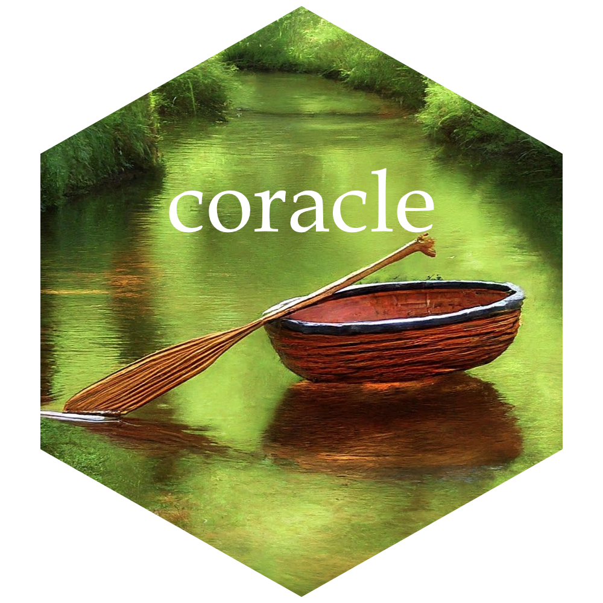

<!-- README.md is generated from README.Rmd. Please edit that file -->

# coracle



<!-- badges: start -->

[](https://lifecycle.r-lib.org/articles/stages.html#experimental)
[](https://CRAN.R-project.org/package=coracle)

<!-- badges: end -->

Correlations of Columns \>\> “Corr” & “Col” \>\> “Coracle”

## Installation

You can install the development version of coracle from
[GitHub](https://github.com/) with:

``` r
# install.packages("pak")
pak::pak("raykrajci/coracle")
```
